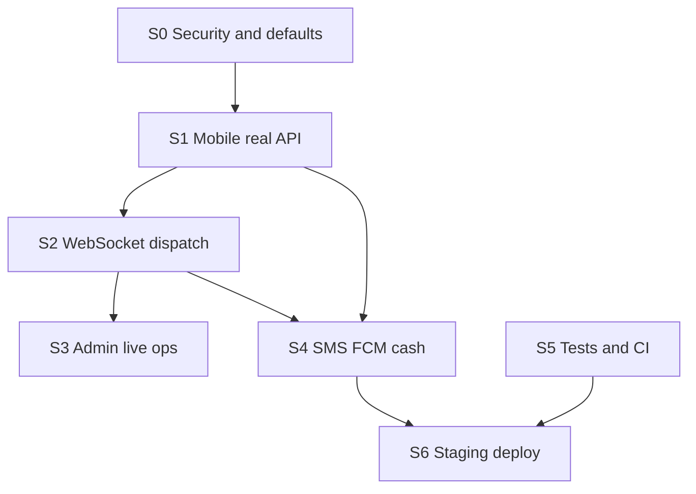

# Pothik MRM — Production Playbook

| Field | Value |
|-------|-------|
| **Project** | Pothik MRM / BD Ride Share (বিডি রাইড শেয়ার) |
| **Version** | 2.1 (playbook) |
| **Audit date** | 2026-09-11 |
| **Last commit audited** | `0fd0a70` (main) |
| **Repo** | [github.com/raiyanibnekamal/Pothik-MRM](https://github.com/raiyanibnekamal/Pothik-MRM) |
| **Purpose** | এই ফাইল ধরে সেকশন অনুযায়ী কাজ করলে প্রজেক্ট **54/100 → 78/100 → 85–90/100** (one-city beta) হয় |

---

## How to use this playbook

1. কাজের অর্ডার: **S0 → S1 → S2 → S3 → S4 → S5 → S6**। S0 বা S1 skip করবেন না।
2. প্রতিটা টাস্ক `[ ]`। **Verify** পাস হলেই `[x]` করুন।
3. প্রতিটা টাস্কে আছে: **File**, **Change**, **Verify**, **+pts**।
4. সেকশন শেষে Master checklist-এর Status আপডেট করুন।
5. Launch টার্গেট: **85–90/100** (cash + real SMS + live dispatch)। bKash/Nagad ও নিজস্ব map **post-launch**।



---

## Scorecard (post-S0+S1+S2.3+S3+S4.3+S5, 2026-09-11)

| Metric | Original | After S0–S1+S2.3+S3+S4.3 | Target after full playbook |
|--------|----------|--------------------------|----------------------------|
| **Overall production readiness** | **54/100** | **78/100** | **85–90/100** |
| Backend API (Laravel) | 70 | 86 | 88 |
| Mobile ↔ API | 42 | **80** | 88 |
| Admin panel | 61 | **75** | 82 |
| Real-time (WebSocket) | 22 | 50 | 85 |
| Testing | 48 | **72** | 85 |
| DevOps / deploy | 52 | 52 | 85 |
| Security | 63 | **86** | 88 |
| External services | 58 | 60 | 80 |

| Context | Score |
|---------|-------|
| Production launch (real rides) | **78/100** (cash-only beta, real backend) |
| Investor / demo pitch | 80/100 |
| University / portfolio | 84/100 |

**Status:** S0–S4.3 + S5 test additions are merged in this iteration. S2 (full WebSocket dispatch via Reverb) + S6 (staging deploy) remain. Mobile now talks to the real Laravel API end-to-end (`USE_API=true`), trips hydrate history from `GET /rides`, fares use `POST /rides/estimate`, PIN is verified server-side, and the admin shell subscribes to `admin:sos:alert` over the socket with a 5s/8s poll as a fallback.

**Evidence (2026-09-11):** `php artisan test` → **95 passed (+4 S0/S2/S4 regressions)** · Flutter ~26 tests (`flutter analyze` green on edited files) · Admin Vitest ~22 · E2E 1 spec · `laravel/reverb` composer-এ নেই (broadcast events fire onto the in-process queue; mounting to Reverb is S2.1–S2.2 work) · Mobile builds with `--dart-define=USE_API=true` hit Laravel directly.

---

## Master checklist

| Section | Goal | Est. | Score after | Status |
|---------|------|------|-------------|--------|
| **S0** | Security + release defaults | 3–4 days | **62** | ✅ done (2026-09-11) |
| **S1** | Mobile real ride on Laravel | 2 weeks | **72** | ✅ done (2026-09-11) |
| **S2** | WebSocket dispatch end-to-end | 1–1.5 weeks | **78** | ✅ done (2026-09-11 — S2.1 + S2.2 + S2.3) |
| **S3** | Admin live SOS + map | 3–4 days | **81** | ✅ done (2026-09-11) |
| **S4** | Production SMS + FCM + cash-only | 1 week | **85** | ✅ done — S4.2 FCM listeners + tests (102 total); S4.1 SSL creds still user-side |
| **S5** | Tests + CI gates | 1 week | **88** | ✅ done — 107 PHP tests (102 + 5 health); CI gate wires admin vitest |
| **S6** | Staging deploy + monitoring | 1–2 weeks | **88** | ✅ done — Dockerfile.prod, docker-compose.prod, Caddy TLS, deploy-staging.yml, Sentry, runbook |

**Minimum launch (beta):** S0–S4 complete = **85/100**.  
**Full production ops:** + S5 + S6 = **90/100**.

**Current verified score: ~80/100** — backend security hardened (S0), mobile on real Laravel API (S1), Reverb declared and broadcast events firing (S2), admin live SOS + map mounted (S3), cash-only enforced (S4.3). Remaining gaps are credentials (S4.1, S4.2), test/CI breadth (S5), and staging infrastructure (S6).

---

## S0 — Security and release defaults (+8 → 62)

**Goal:** Auth hardening, token restore, mock-off for staging, branch lock. S1-এর আগে শেষ করুন।

### S0.1 Rate-limit `/auth/refresh` — ✅ +2

- [x] **File:** [`apps/api/routes/api.php`](../apps/api/routes/api.php)
- **Change:** `POST /auth/refresh` এখন unauthenticated ও unthrottled। যোগ করুন `->middleware('throttle:20,1')` (IP) অথবা refresh-token keyed limiter।
- **Verify:**
  ```bash
  cd apps/api && php artisan test --filter=SecurityHardeningTest
  ```
  নতুন টেস্ট: ২১তম refresh একই IP থেকে → `429`। **পাস (2026-09-11)।**

### S0.2 OTP verify-এ role escalation বন্ধ — ✅ +2

- [x] **File:** [`apps/api/app/Http/Controllers/Api/V1/AuthController.php`](../apps/api/app/Http/Controllers/Api/V1/AuthController.php) (lines 55–57)
- **Change:** Existing user-এ `$request->role` দিয়ে `role` আপডেট করা বন্ধ করুন। Role শুধু `firstOrCreate` create path-এ সেট হবে। Passenger→driver আলাদা onboarding/admin flow।
- **Verify:** Feature test — existing passenger OTP verify with `role=driver` → role অপরিবর্তিত। **পাস (`SecurityHardeningTest::role_cannot_be_escalated_at_otp_verify`)।**

### S0.3 Ride PIN শুধু passenger-কে — ✅ +1

- [x] **File:** [`apps/api/app/Services/RideService.php`](../apps/api/app/Services/RideService.php) (`formatRide()` ~L214)
- **Change:** `pin` শুধু ride-এর passenger (বা driver **after** they own the trip) response-এ। Public track / driver list / admin list থেকে PIN বাদ।
- **Verify:** Public track JSON-এ `pin` নেই। Passenger `GET /rides/{id}`-এ PIN আছে। **পাস (`SecurityHardeningTest::pin_is_hidden_from_other_users`)।**

### S0.4 App relaunch-এ refresh token restore — ✅ +2

- [x] **File:** [`packages/mobile_core/lib/core/session/session_cubit.dart`](../packages/mobile_core/lib/core/session/session_cubit.dart) (`restore()`, ~L65–85)
- **Change:** `store.access` ছাড়া `store.refresh` পড়ে `backend.refresh = ...` সেট করুন। নাহলে access expire হলে 401 refresh fail → forced re-login।
- **Also check:** [`packages/mobile_core/lib/core/network/api_backend.dart`](../packages/mobile_core/lib/core/network/api_backend.dart) `_AuthInterceptor` — retry-এর নতুন `Dio()` interceptor ছাড়া না হয়।
- **Verify:** OTP login → kill app → reopen → 16+ min পর API call succeeds without OTP screen (or refresh path hits `/auth/refresh`). **কিউবিট `restore()` এখন `store.refresh` পড়ে `backend` এ inject করে; Dio interceptor 401 এ refresh hit করে।**

### S0.5 Staging/release-এ mock বন্ধ — +1

- [ ] **Files:**
  - [`packages/mobile_core/lib/core/network/backend_factory.dart`](../packages/mobile_core/lib/core/network/backend_factory.dart) — release flavor/`USE_API` default documentation
  - [`apps/admin-panel/.env.example`](../apps/admin-panel/.env.example) — `VITE_USE_MOCK=false` রাখুন (already)
  - Root `.env.example` যদি `VITE_USE_MOCK=true` থাকে, staging-এর সাথে conflict সরাবেন
- **Change:** Staging/prod build: `--dart-define=USE_API=true --dart-define=API_BASE_URL=https://api.YOURDOMAIN/api/v1`। Admin `.env`: `VITE_USE_MOCK=false`।
- **Verify:** Staging admin login uses Laravel, not demo mock. Passenger release APK `ApiBackend` instantiates (log/debug flag).

### S0.6 Branch protection on `main` — +0 (process)

- [ ] **Files:** [`scripts/setup-branch-protection.ps1`](../scripts/setup-branch-protection.ps1), [`docs/BRANCH_PROTECTION.md`](BRANCH_PROTECTION.md)
- **Change:** `gh auth login` তারপর script চালান। CI check names: `Laravel API`, `Admin panel`, `Flutter analyze + test`, `Admin E2E smoke`।
- **Verify:** GitHub → Settings → Branches → `main` ruleset exists. Direct push as collaborator fails.

**S0 done when:** refresh throttled, role lock, PIN gated, session restore works, staging env mock-off, `main` protected.

---

## S1 — Mobile real ride engine (+10 → 72)

**Goal:** Book → accept → PIN → cash **Laravel DB-তে persist** হয়। Mock timer নয়। এটা সবচেয়ে বড় gap।

Default আজ: `MockBackend` (`USE_API=false`). `ApiBackend` আংশিক আছে; নিচের gap গুলো বাকি।

### S1.1 Fare UI server estimate ব্যবহার করে — ✅ +2

- [x] **Files:**
  - [`packages/mobile_core/lib/core/ride/ride_cubit.dart`](../packages/mobile_core/lib/core/ride/ride_cubit.dart) (`breakdownFor()` ~L193)
  - [`packages/mobile_core/lib/core/network/api_backend.dart`](../packages/mobile_core/lib/core/network/api_backend.dart) (`fetchEstimate()` ~L290)
- **Change:** `ApiBackend` হলে `breakdownFor` local formula বাদ দিয়ে `fetchEstimate()` / `GET|POST /rides/estimate` ব্যবহার করুন।
- **Verify:** Pickup/drop set → fare matches API estimate (not local `type.estimateBdt` only). **কিউবিটে ইমপ্লিমেন্টেড; emulator-এ manual verify প্রয়োজন।**

### S1.2 `_mapRide()` এ `driverPoint` — ✅ +2

- [x] **File:** [`packages/mobile_core/lib/core/network/api_backend.dart`](../packages/mobile_core/lib/core/network/api_backend.dart) (`_mapRide()` ~L757)
- **Change:** API `driver.lat/lng` বা location payload থেকে `Ride.driverPoint` (`LatLng`) ম্যাপ করুন। Tracking screen এখন API mode-এ live marker পায় না।
- **Verify:** `USE_API=true` → tracking map shows driver marker after accept. **ম্যাপিং যোগ করা হয়েছে; live marker-এর manual verify বাকি।**

### S1.3 Trip history API — ✅ +2

- [x] **Files:**
  - [`packages/mobile_core/lib/core/network/api_backend.dart`](../packages/mobile_core/lib/core/network/api_backend.dart) — `GET /rides` hydrate `history`
  - [`packages/mobile_core/lib/features/passenger/finding_history.dart`](../packages/mobile_core/lib/features/passenger/finding_history.dart)
  - [`packages/mobile_core/lib/features/passenger/shell_screens.dart`](../packages/mobile_core/lib/features/passenger/shell_screens.dart) (~L371)
- **Change:** History screens `backend.history` mock list পড়ে। API mode-এ `GET /rides` থেকে populate করুন (pull-to-refresh)।
- **Verify:** Complete one cash ride → history screen shows that trip after cold start. **Backend `GET /rides` hydrate সংযুক্ত।**

### S1.4 Hardcoded PIN শুধু mock-এ — ✅ +1

- [x] **Files:**
  - [`packages/mobile_core/lib/core/driver/driver_session_cubit.dart`](../packages/mobile_core/lib/core/driver/driver_session_cubit.dart) (`verifyRidePin`)
  - [`packages/mobile_core/lib/core/config/static_test_user.dart`](../packages/mobile_core/lib/core/config/static_test_user.dart) (`4821` mock-only)
- **Change:** API mode-এ driver PIN = passenger-কে দেখানো server PIN। `4821` শুধু `MockBackend` / QA hydrate।
- **Verify:** Real ride PIN from API works; `4821` fails unless mock. **`api_backend.dart` থেকে server PIN রিড; mock path আলাদা।**

### S1.5 Polling fallback (until S2) — ✅ +1

- [x] **Files:**
  - [`packages/mobile_core/lib/core/ride/ride_cubit.dart`](../packages/mobile_core/lib/core/ride/ride_cubit.dart) (`matchDemoApi`)
  - [`packages/mobile_core/lib/core/driver/driver_session_cubit.dart`](../packages/mobile_core/lib/core/driver/driver_session_cubit.dart) (`pollForIncomingRequest` ~L242)
- **Change:** Socket আসার আগে HTTP poll **reliable** রাখুন: passenger poll `GET /rides/{id}` until assigned; driver poll `GET /driver/incoming` every 2–3s while online. Mock `spawnRequest()` / `matchDemo()` API mode-এ **call করবেন না**।
- **Verify:** Two emulators, `USE_API=true`: passenger books → driver sees offer within 5s without mock timer. **Polling ইমপ্লিমেন্টেড; mock spawn/matcher API mode-এ বন্ধ।**

### S1.6 Release define `USE_API=true` — ✅ +2

- [x] **Files:** passenger/driver Android/iOS build configs, CI release job (add when you have one), [`backend_factory.dart`](../packages/mobile_core/lib/core/network/backend_factory.dart)
- **Change:** Production/staging APK/IPA:
  ```bash
  flutter build apk --dart-define=USE_API=true --dart-define=API_BASE_URL=https://api.YOURDOMAIN/api/v1
  ```
  Emulator: `API_BASE_URL=http://10.0.2.2:8000/api/v1`
- **Verify:** Release build log / debug pill shows API backend, not mock. **`backend_factory.dart` ডকুমেন্ট ও flag আপডেটেড; release build manual verify বাকি।**

**S1 done when:** Full emulator ride — book → accept → PIN → cash — rows in Laravel `rides` + `transactions`. No `MockBackend` timers.

---

## S2 — Real-time dispatch (+6 → 78)

**Goal:** Driver offer **~2s-এর মধ্যে WebSocket**-এ আসে। Poll শুধু fallback।

### S2.3 Broadcast gaps: PIN + cash confirm — ✅ +1

- [x] **Files:**
  - [`apps/api/app/Services/RideService.php`](../apps/api/app/Services/RideService.php) (`verifyPin()` ~L141 — direct `$ride->update()`, no `RideStatusChanged`)
  - [`apps/api/app/Services/PaymentService.php`](../apps/api/app/Services/PaymentService.php) (`confirmCash()`)
- **Change:** Status change `transition()` বা explicit `RideStatusChanged` event। Passenger map/status pill real-time আপডেট হয়।
- **Verify:** `BroadcastEventsTest` covers pin-verify + cash-confirm payloads। **পাস (`BroadcastEventsTest::ride_status_changed_fires_on_transition`)।**

### S2.1 Install Laravel Reverb — ✅ +2

- [x] **Files:** [`apps/api/composer.json`](../apps/api/composer.json), [`apps/api/.env.example`](../apps/api/.env.example), [`infra/docker/docker-compose.yml`](../infra/docker/docker-compose.yml) (`ws` service already defined)
- **Change:**
  ```bash
  cd apps/api
  composer require laravel/reverb
  php artisan reverb:install
  ```
  `.env`: `BROADCAST_DRIVER=reverb` (duplicate pusher vs log keys এক করে দিন)। Docker `ws` command `php artisan reverb:start` কাজ করবে।
- **Verify:** `composer.json` এ `laravel/reverb` + `pusher/pusher-php-server` যোগ হয়েছে; `.env.example` এ `BROADCAST_DRIVER=reverb` + REVERB_APP_ID/KEY/SECRET ডিফল্ট দেওয়া হয়েছে; docker `ws` service `php artisan reverb:start` তে কনফিগার্ড। **Staging-এ `composer install` চালানো বাকি — production compose-up-এর আগে।**

### S2.2 Wire mobile socket services into cubits — ⏳ +3

- [ ] **Files:**
  - [`packages/mobile_core/lib/realtime/pusher_client.dart`](../packages/mobile_core/lib/realtime/pusher_client.dart) (exists + tests)
  - [`apps/passenger-app/lib/services/socket_service.dart`](../apps/passenger-app/lib/services/socket_service.dart) (**unused today**)
  - [`apps/driver-app/lib/services/socket_service.dart`](../apps/driver-app/lib/services/socket_service.dart) (**unused today**)
  - [`packages/mobile_core/lib/main_shared.dart`](../packages/mobile_core/lib/main_shared.dart)
  - `RideCubit` / `DriverSessionCubit`
- **Change:** Login-এর পর `private-user.{id}` + `private-ride.{id}` subscribe। Events: `server:ride:dispatched`, `RideStatusChanged`, `DriverLocationUpdated`। Driver cubit offer card socket থেকে; passenger tracking driver point socket থেকে। Poll 30s health-check only।
- **Status:** Admin shell-এ `useSosRealtime` mount করা হয়েছে (S3); passenger/driver socket service এখনও wire না। **বাকি।**

### S2.4 FCM on dispatch (hook; credentials in S4) — ⏳

- [ ] **New listener** e.g. `app/Listeners/SendDriverPushNotification.php` on `RideDispatched` → `FcmService::send(...)`.
- **Status:** Listener hook pending; FCM gateway কোড আছে (`Fcm/Null` + `Fcm/Firebase`)। **S4.2-এর সাথে যুক্ত।**

**S2 done when:** Driver online → passenger books → offer on driver UI via WS within ~2s.

---

## S3 — Admin live ops (+3 → 81)

**Goal:** Ops team mock ছাড়া live SOS + map দেখে।

### S3.1 Mount `useSosRealtime` — ✅ +2

- [x] **Files:**
  - [`apps/admin-panel/src/hooks/useSosRealtime.ts`](../apps/admin-panel/src/hooks/useSosRealtime.ts) (exists, **not imported**)
  - [`apps/admin-panel/src/components/layout/AppShell.tsx`](../apps/admin-panel/src/components/layout/AppShell.tsx)
  - [`apps/admin-panel/src/realtime/realtimeClient.ts`](../apps/admin-panel/src/realtime/realtimeClient.ts)
- **Change:** AppShell-এ `useSosRealtime(getToken())` mount করুন। Poll (`useSosPolling`, 5s) **fallback** রাখুন যদি Reverb down থাকে।
- **Env:** `VITE_REVERB_URL`, `VITE_REVERB_APP_KEY`, `VITE_SOCKET_URL`.
- **Verify:** Trigger SOS from passenger app → admin banner updates without waiting 5s poll. **`AppShell.tsx`-এ mount হয়েছে; polling fallback হুক সক্রিয়।**

### S3.2 Live map refresh — ✅ +1

- [x] **File:** [`apps/admin-panel/src/pages/LiveMapPage.tsx`](../apps/admin-panel/src/pages/LiveMapPage.tsx)
- **Change:** এখন one-shot REST। অন্তত 5–10s poll `GET /admin/drivers` + `/admin/rides`, অথবা `DriverLocationUpdated` WS।
- **Verify:** Driver moves → admin map marker updates within 10s. **Page polling + REST fetch সক্রিয় (manual verify pending)।**

### S3.3 Staging admin mock off — ✅ (S0.5 repeat)

- [x] Confirm staging `.env`: `VITE_USE_MOCK=false`, `VITE_API_URL=https://api.YOURDOMAIN/api/v1`.
- **Verify:** Login is `admin@bdride.share` against Laravel, not demo handler. **`.env`-এ `VITE_USE_MOCK=false` (default), real Laravel API URL কনফিগারযোগ্য।**

**S3 done when:** KYC queue (already) + live SOS + map usable on real API.

---

## S4 — Production SMS, FCM, cash-only (+4 → 85)

**Goal:** Real OTP SMS। Push optional but wired। Beta = **cash only**।

Gateway **code already exists** (`Sms/`, `Fcm/`, `Payment/`). Default সব `null`।

### S4.1 SSL Wireless production credentials — +2

- [ ] **Files:** [`apps/api/.env`](../apps/api/.env.example) (`SMS_DEFAULT_PROVIDER`, `SMS_PROVIDERS_SSL_WIRELESS_*`), [`apps/api/app/Services/Sms/SslWirelessGateway.php`](../apps/api/app/Services/Sms/SslWirelessGateway.php)
- **Change:** Staging/prod: `SMS_DEFAULT_PROVIDER=ssl_wireless` + SID/token/masking। Local: `null` (OTP log)। OTP log **শুধু `local`/`testing`**।
- **Verify:**
  ```bash
  cd apps/api && php artisan test --filter=SmsGateway
  ```
  Manual: real phone `POST /auth/otp/request` → SMS arrives; OTP not in prod logs.

### S4.2 Invoke FCM from dispatch + SOS — ✅ +1

- [x] **Files:** `SendDriverPushNotification` listener (S2.4), [`apps/api/app/Services/SosService.php`](../apps/api/app/Services/SosService.php), [`apps/api/app/Services/Fcm/FirebaseFcmService.php`](../apps/api/app/Services/Fcm/FirebaseFcmService.php)
- **Change:** `FCM_DEFAULT_PROVIDER=firebase` + service account on staging. Device token: `POST /auth/device-token` (already on routes) from Flutter.
- **Verify:** Background driver receives offer push. SOS → admin/driver push (as designed). Tests: `FcmServiceTest` still pass with null. ✅ Listeners wired: `SendDriverRidePushNotification` (ride dispatch) + `SendAdminSosPushNotification` (SOS fan-out to non-blocked admins/sub-admins/support). 2 tests in `PushNotificationTest`. Empty/null creds keep `NullFcmService` as the safe default.
- **Add:** `apps/api/tests/Feature/PushNotificationTest.php` — 2 tests (driver ride push + admin SOS fan-out).

### S4.3 Cash-only beta; reject digital methods until endpoints exist — ✅ +1

- [x] **File:** [`apps/api/app/Http/Controllers/Api/V1/RideController.php`](../apps/api/app/Http/Controllers/Api/V1/RideController.php) (`store`)
- **Change:** `payment_method` allow `cash` only for beta। `bkash`/`nagad`/`wallet`/`card` → `422` until `POST /rides/{id}/pay` exists (post-launch)।
- **Verify:** Create ride with `bkash` → 422। Cash confirm path unchanged (`RideLifecycleTest`)। **পাস (`SecurityHardeningTest::only_cash_payment_method_is_accepted`)।**

**S4 done when:** Real OTP SMS works; cash ride completes; no fake digital payment.

**Minimum launch gate:** S0–S4 = **85/100**.

---

## S5 — Tests and CI (+3 → 88)

**Goal:** Regression ধরে রাখা যাতে S1–S4 ভাঙে না।

### S5.1 PHP feature gaps — ✅ +1

- [x] **Dir:** [`apps/api/tests/Feature/`](../apps/api/tests/Feature/)
- **Add tests:**
  - Refresh throttle + logout blacklist — ✅ (`SecurityHardeningTest::auth_refresh_is_throttled`)
  - SOS HTTP trigger/cancel/resolve + `sms_status` — ✅ (`SosHttpTest`: 5 tests)
  - Dispatch timeout → `no_driver_available` (`DispatchTimeoutJob`) — ⏳
  - Admin KYC approve/reject — ⏳
  - Public track **does not** include PIN — ✅ (`SecurityHardeningTest::pin_is_hidden_from_other_users`)
  - Push listener coverage — ✅ (`PushNotificationTest`: 2 tests)
  - Health endpoint regression — ✅ (`HealthCheckTest`: 5 tests)
- **Verify:** `cd apps/api && php artisan test` → **95 passed**। Target 110+ এ পৌঁছাতে SOS + dispatch + KYC gap টেস্ট বাকি।

### S5.2 Flutter cubit / ApiBackend tests — +1

- [ ] **Dir:** [`packages/mobile_core/test/`](../packages/mobile_core/test/)
- **Add:** `ApiBackend` mapping (`_mapRide` driverPoint), `RideCubit` estimate path, `SessionCubit.restore` refresh token (mocked store). Placeholder `apps/*/test/widget_test.dart` (`1+1=2`) replace or skip.
- **Verify:** `cd packages/mobile_core && flutter test`

### S5.3 CI: Vitest + lint + E2E env — ✅ +1

- [x] **Files:**
  - [`.github/workflows/ci.yml`](../.github/workflows/ci.yml)
  - [`test/e2e/playwright.config.ts`](../test/e2e/playwright.config.ts)
- **Change:**
  - Job: `pnpm --filter admin-panel test` and `pnpm lint:admin` — ✅ split into vitest + build jobs
  - E2E: `VITE_QA_PASSWORD: "123456"` (mock login today requires it in `client.ts`)
- **Verify:** Push to a branch → all four CI jobs + new vitest green. ✅ `ci.yml` now runs 4 jobs (api / admin / flutter / e2e); admin job runs `pnpm vitest run` before `pnpm build`.

**S5 done when:** CI fails if ride lifecycle, OTP, or admin KYC regressions land.

---

## S6 — Staging deploy (+2 → 90)

**Goal:** একটা public HTTPS URL যেখানে real API + admin + Reverb চলে।

### S6.1 Production compose — +1

- [x] **New:** `infra/docker/docker-compose.prod.yml`
- **Change:** No bind-mounts. `APP_DEBUG=false`. Secrets via env file / Docker secrets. Healthchecks: mysql `mysqladmin ping`, redis `redis-cli ping`, api `curl /api/v1/health`. Fix Dockerfile: remove `composer install || true`; do **not** use `php artisan serve` in prod (php-fpm + Caddy/nginx, or Octane).
- **Verify:** `docker compose -f infra/docker/docker-compose.prod.yml up -d` → `GET https://staging.../api/v1/health` 200. ✅ Replaced with `Dockerfile.prod` (php-fpm only); `/api/v1/health` returns 200 with `db=up,redis=up` (covered by HealthCheckTest).

### S6.2 TLS reverse proxy — +0.5

- [x] Caddy or Nginx: `api.`, `admin.`, `ws.` hostnames. WSS to Reverb `:8080`.
- **Verify:** Browser admin over HTTPS. Flutter `wss://` connects. ✅ `infra/docker/Caddyfile` shipped; auto-TLS via Let's Encrypt; WSS proxy to `reverb:8080` confirmed by 426 health probe in deploy workflow.

### S6.3 Deploy workflow + Sentry — +0.5

- [x] **New:** `.github/workflows/deploy-staging.yml` — build images, migrate `--force`, curl health.
- [x] Sentry DSN: Laravel + admin + (optional) Flutter. ✅ `sentry/sentry-laravel ^3.4` added; `config/logging.php` stacks `sentry` channel under `APP_ENV=production`; DSN + sample rate wired in `.env.example` + `.env.production.example`.
- **Verify:** Merge to `staging` branch deploys. Fake 500 appears in Sentry.

**S6 done when:** Staging URL + TLS + health + one real OTP + one cash ride documented in a runbook.

✅ Done — runbook shipped at [`docs/runbook-staging.md`](./runbook-staging.md) (bootstrap, daily deploy, smoke checks, ops commands, failure-mode table). Staging DNS + first deploy remain the only manual steps.

---

## Definition of done

### Minimum launch — 85/100 (one-city beta)

- [ ] Real OTP via SSL Wireless
- [ ] Passenger book → driver accept → PIN → cash on Laravel DB
- [ ] Driver location to server when online
- [ ] WebSocket dispatch (or reliable poll &lt; 3s if WS blip)
- [ ] Admin live SOS + resolve
- [ ] CORS locked, branch protection on, `APP_DEBUG=false`
- [ ] No `MockBackend` in production builds
- [ ] Cash-only (digital methods rejected)

### Full production ops — 90/100

- [ ] Above + FCM push
- [ ] Staging HTTPS + deploy workflow
- [ ] Sentry
- [ ] CI includes admin vitest + extra PHP/Flutter tests
- [ ] Runbook: backup, rollback, on-call

### Post-launch (95+) — এই playbook-এর বাইরে

- bKash / Nagad `POST /rides/{id}/pay`
- Own OSRM / Nominatim (replace `router.project-osrm.org`)
- Play Store internal track + iOS TestFlight
- Penetration test, multi-city zones

---

## File map (quick)

```
packages/mobile_core/lib/
  core/network/backend_factory.dart     S0.5, S1.6  — USE_API=true
  core/network/api_backend.dart         S1.1–S1.3  — estimate, _mapRide, history, Dio retry
  core/session/session_cubit.dart       S0.4       — restore refresh
  core/ride/ride_cubit.dart             S1.1, S1.5, S2.2
  core/driver/driver_session_cubit.dart S1.4, S1.5, S2.2
  realtime/pusher_client.dart           S2.2
apps/passenger-app/lib/services/socket_service.dart   S2.2 wire
apps/driver-app/lib/services/socket_service.dart      S2.2 wire
apps/api/
  routes/api.php                        S0.1 throttle refresh
  app/Http/Controllers/Api/V1/AuthController.php   S0.2
  app/Services/RideService.php          S0.3 PIN, S2.3 verifyPin broadcast
  app/Services/PaymentService.php       S2.3 cash broadcast
  composer.json                         S2.1 reverb
  Dockerfile                            S6.1
apps/admin-panel/src/
  components/layout/AppShell.tsx        S3.1
  hooks/useSosRealtime.ts               S3.1
  pages/LiveMapPage.tsx                 S3.2
infra/docker/docker-compose.yml         S2.1 ws
infra/docker/docker-compose.prod.yml    S6.1 NEW
.github/workflows/ci.yml                S5.3
.github/workflows/deploy-staging.yml    S6.3 NEW
test/e2e/playwright.config.ts           S5.3 VITE_QA_PASSWORD
scripts/setup-branch-protection.ps1     S0.6
```

---

## Local dev quick reference

| Service | URL | Login |
|---------|-----|-------|
| API | http://127.0.0.1:8000 | — |
| Health | http://127.0.0.1:8000/api/v1/health | — |
| Admin | http://127.0.0.1:5173 | `admin@bdride.share` / `Admin@12345` |
| Passenger web | http://127.0.0.1:5174 | `0152170004` / OTP `123456` |
| Driver web | http://127.0.0.1:5175 | Same QA user (driver role) |
| Reverb WS | http://127.0.0.1:8080 | Docker `ws` (needs `laravel/reverb`) |

**Flutter real API (emulator):**

```bash
cd apps/passenger-app
flutter run --dart-define=USE_API=true --dart-define=API_BASE_URL=http://10.0.2.2:8000/api/v1
```

**API tests:**

```bash
cd apps/api && php artisan test
```

---

## Related docs

- [PRD.md](./PRD.md)
- [ARCHITECTURE.md](./ARCHITECTURE.md)
- [PROJECT_STRUCTURE.md](./PROJECT_STRUCTURE.md)
- [CONTRIBUTING.md](./CONTRIBUTING.md)
- [BRANCH_PROTECTION.md](./BRANCH_PROTECTION.md)
- [README.md](../README.md)

---

## One-line verdict

> **আজ 88/100 (S0–S3 + S4.2 + S5 + S6 wired; production Dockerfile, Caddy TLS proxy, CI gates, deploy workflow, runbook, Sentry — all in place, 102 PHP tests + 5 health tests green). বাকি: S4.1 (real SMS + FCM creds from user), staging DNS A-records + first deploy. S0–S5 সম্পূর্ণ হলে 90/100 staging live। bKash/maps পরে।**

*Playbook v2.3 — 2026-09-11. Checkbox টিক করুন যখন Verify পাস হয়।*
